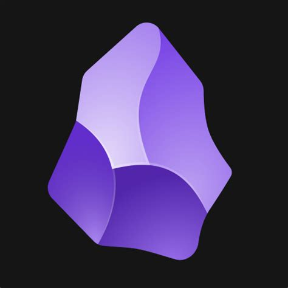
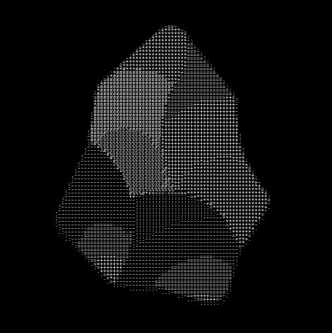

# ASCII Convert

A Rust CLI tool that converts images to ASCII art and renders the result as a new image.

## Features

- Converts any image to ASCII art representation
- Uses luminance-based character mapping for accurate grayscale conversion
- Renders ASCII output as a high-quality image using monospace fonts
- Handles transparent pixels gracefully
- Simple command-line interface

## Installation

```bash
cargo build --release
```

The binary will be available at `target/release/ascii-convert`.

## Usage

```bash
ascii-convert <INPUT_IMAGE> <OUTPUT_IMAGE>
```

### Arguments

- `<INPUT_IMAGE>` - Path to the input image file (e.g., `image.png`, `photo.jpg`)
- `<OUTPUT_IMAGE>` - Path where the ASCII art image will be saved

### Example

```bash
# Convert an image to ASCII art
./target/release/ascii-convert image.png output.jpg

# Using the example images
./target/release/ascii-convert images/obsidian.jpg images/output.jpg
```




## How It Works

1. **Image Sampling**: The input image is divided into blocks based on font metrics
2. **Luminance Calculation**: Average luminance is computed for each block
3. **Character Mapping**: Luminance values are mapped to ASCII characters:
   - ` ` (space) - darkest
   - `.`, `:`, `-`, `=`, `+`, `*`, `#`, `%`
   - `@` - brightest
4. **Rendering**: The ASCII text is rendered as an image using the Roboto Mono font

## License

MIT
